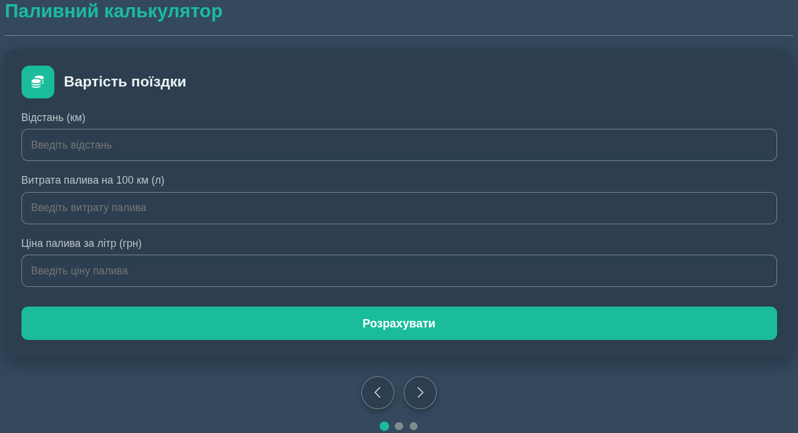

## Паливний калькулятор ⛽

Веб-застосунок для розрахунку витрат палива, вартості поїздки та максимальної відстані на наявному пальному. Зручний інтерфейс із слайдером для швидкого переключення між різними типами розрахунків.

---

## 📂 Функціонал

- **Вартість поїздки** — розрахунок суми витрат пального за заданою відстанню, витратою та ціною палива  
- **Можлива відстань** — визначення максимальної відстані на наявному пальному  
- **Витрата палива** — розрахунок середньої витрати на 100 км  
- **Зручний інтерфейс** — слайдер із кнопками та індикаторами  
- **Підтримка клавіатури та сенсорного управління** (стрілки та свайпи)  
- **Офлайн-режим** — індикатор при відсутності інтернету  
- **PWA** — можливість встановлення як прогресивного веб-додатку  

---

## 🛠 Технології

HTML, CSS, JavaScript, Service Worker, PWA  

---

## 📷 Скриншот

